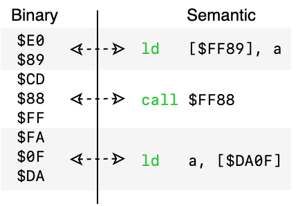

# Windfish CPU

The `CPU` module defines a protocol-based representation of a CPU's instruction set that can be used to translate between binary and semantic representations of instructions.



### Defining the shape of an instruction

Implementing a CPU starts by implementing the `InstructionSpec` protocol, typically as an enum. The `InstructionSpec` type defines both the potential shape of an instruction and the assembly language names of the instructions. In the example below, we define an instruction specification that is able to represent four different types of operations, most accepting one or more operands:

```swift
enum Spec: CPU.InstructionSpec {
  typealias WidthType = UInt16

  case nop
  case cp(Numeric)
  case ld(Numeric, Numeric)
  case call(Condition? = nil, Numeric)

  enum Numeric: Hashable {
    case imm8
    case imm16
    case a
    case arg(Int)
  }

  enum Condition: Hashable {
    case nz
    case z
  }
}
```

This specification allows us to represent any of the following instructions:

```swift
.nop
.cp(.a)
.cp(.imm8)
.ld(.a, .imm8)
.call(nil, .imm16)
.call(.z, .imm16)
```

### Defining an instruction set

Instruction specifications can be used to create an instruction table where each index maps to the binary value of a corresponding instruction specification:

```swift
static let table: [Instruction.Spec] = [
  /* 0x00 */ .nop,
  /* 0x01 */ .ld(.a, .imm8),
  /* 0x02 */ .ld(.a, .imm16),
  /* 0x03 */ .call(.nz, .imm16),
  /* 0x04 */ .call(nil, .imm16),
]
```

This table is then stored within an `InstructionSet`:

```swift
struct InstructionSet: CPU.InstructionSet {
  typealias InstructionType = Instruction

  static let table: [Instruction.Spec] = [
    /* 0x00 */ .nop,
    /* 0x01 */ .ld(.a, .imm8),
    /* 0x02 */ .ld(.a, .imm16),
    /* 0x03 */ .call(.nz, .imm16),
    /* 0x04 */ .call(nil, .imm16),
  ]
  static var prefixTables: [Instruction.Spec: [Instruction.Spec]] = []
}
```

The `InstructionSet` type defines common methods for working with an instruction set including the ability to compute the width of an instruction and converting the instruction's opcode to byte and assembly representations. 

```swift
struct InstructionSet: CPU.InstructionSet {
  // ...

  static var widths: [Instruction.Spec : InstructionWidth<UInt16>] = {
    return computeAllWidths()
  }()

  static var opcodeBytes: [Instruction.Spec : [UInt8]] = {
    return computeAllOpcodeBytes()
  }()

  static var opcodeStrings: [Instruction.Spec : String] = {
    return computeAllOpcodeStrings()
  }()
}
```

### Defining an instruction

Instruction specifications form the basis by which real instructions are represented. A real instruction consists of both an instruction specification and any optional immediate values associated with the instruction. 

```swift
struct Instruction: CPU.Instruction {
  let spec: Spec
  let immediate: ImmediateValue?
  
  enum ImmediateValue: CPU.InstructionImmediate {
    case imm8(UInt8)
    case imm16(UInt16)
  }
}
```

For example, `.ld(.a, .imm8)` would be initialized with a 1-byte `.imm8` value. The initialization of an instruction like this would look like so:

```swift
let instruction = Instruction(spec: .ld(.a, .imm8), immediate: .imm8(127))
```
